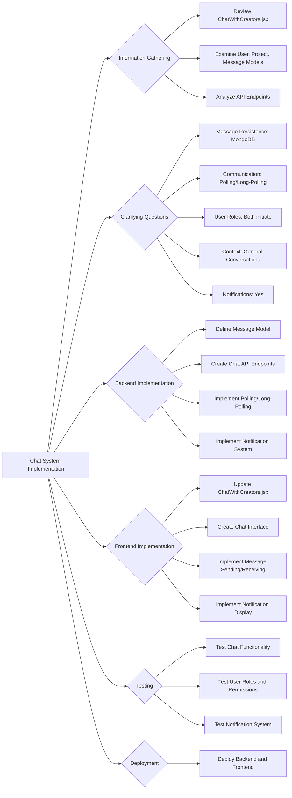

# Chat System Implementation Plan

## 1. Information Gathering

*   Review `client/src/components/pages/collaborator/ChatWithCreators.jsx`
*   Examine User, Project, Message Models (`server/models/user.js`, `server/models/Project.js`, `server/models/Message.js`)
*   Analyze API Endpoints (`server/routes/`, `server/controllers/`)

## 2. Clarifying Questions

*   Message Persistence: MongoDB
*   Communication: Polling/Long-Polling
*   User Roles: Both initiate
*   Context: General Conversations
*   Notifications: Yes

## 3. Implementation Plan

## 4. Detailed Steps

1.  **Backend Implementation:**
    *   **Message Model:** Define a Mongoose schema for messages, including fields for sender, receiver, content, timestamp.
    *   **API Endpoints:** Create API endpoints for:
        *   Fetching a list of users a user can chat with (creators for collaborators, collaborators for creators).
        *   Fetching messages between two users.
        *   Sending a new message.
    *   **Polling/Long-Polling:** Implement the logic for checking new messages periodically.
    *   **Notification System:** Implement a system for sending notifications to users when they receive new messages. This could involve storing notifications in the database and displaying them to the user when they log in, or using a push notification service.
2.  **Frontend Implementation:**
    *   **Update `ChatWithCreators.jsx`:** Modify the component to fetch the list of users from the API endpoint instead of using dummy data.
    *   **Chat Interface:** Create a new component for the chat interface, including:
        *   A list of users to chat with.
        *   A display of messages between the current user and the selected user.
        *   An input field for sending new messages.
    *   **Message Sending/Receiving:** Implement the logic for sending and receiving messages using the API endpoints. Implement the polling/long-polling mechanism to check for new messages.
    *   **Notification Display:** Implement a system for displaying notifications to the user when they receive new messages.
3.  **Testing:**
    *   Test the chat functionality to ensure that messages are sent and received correctly.
    *   Test user roles and permissions to ensure that users can only chat with the appropriate users.
    *   Test the notification system to ensure that users receive notifications when they receive new messages.
4.  **Deployment:**
    *   Deploy the backend and frontend to a production environment.